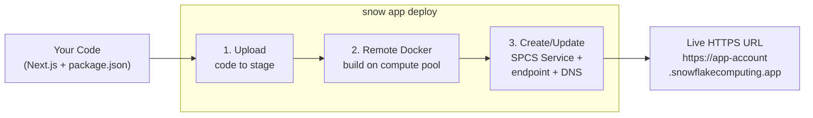
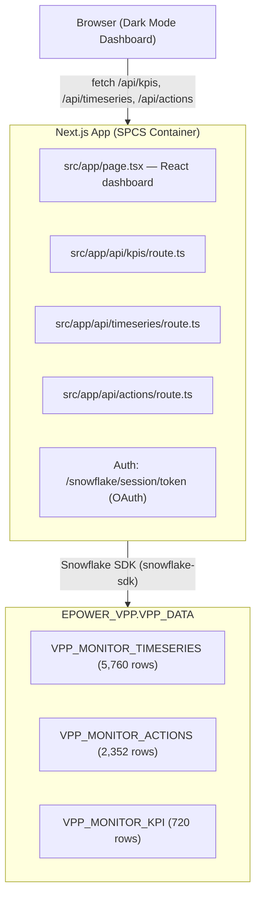

# Snowflake VPP Monitor — Getting Started with App Runtime

A dark-mode Virtual Power Plant performance dashboard deployed as a **Snowflake App** — a Next.js web application running inside Snowflake's container infrastructure. No Docker knowledge, no infrastructure provisioning, no credential management required.

This project is a self-contained getting-started guide for **Snowflake App Runtime** (Public Preview). Clone the repo, load the sample data, deploy in 3 commands.

---

## What Is a Virtual Power Plant (VPP)?

A **Virtual Power Plant** aggregates thousands of small, distributed energy resources — residential solar panels, home batteries, heat pumps, EV chargers — and orchestrates them as if they were a single large power plant. Instead of building a gas turbine, the provider coordinates thousands of home battery systems to absorb cheap electricity and release it when prices spike.

In the real world, companies like [1KOMMA5° (Heartbeat AI)](https://1komma5grad.com/), [Sonnen](https://sonnen.de/), and [Next Kraftwerke](https://www.next-kraftwerke.com/) operate VPPs that trade on European electricity markets.

**Why VPPs matter:**
- **Revenue stream** — The provider takes a share (typically 30%) of every arbitrage margin (buy low, sell high)
- **Customer value** — The remaining 70% goes to the customer as bill savings (typically EUR 50-150/year)
- **Grid stability** — Distributed batteries smooth demand peaks and absorb renewable oversupply
- **Competitive moat** — VPP enrollment increases customer stickiness across all product categories

### The Data Behind This Dashboard

The sample data represents a fleet of ~4,050 home battery systems across 4 German regions (North, South, East, West), serving 3 customer segments (residential, small business, commercial). Each battery's charge/discharge behavior is driven by **real day-ahead electricity prices** from the German DE-LU bidding zone — the same price signal that real VPP operators use.

The dashboard visualizes:
- **Operational metrics** — fleet capacity, battery state-of-charge, solar yield, grid import/export
- **Market context** — day-ahead electricity price movements (EUR/MWh)
- **Financial performance** — arbitrage margins split between customer and provider

---

## What You'll Build

| Section | Description |
|---------|-------------|
| **KPI Cards** | Active devices, battery SOC %, solar yield, day-ahead price, customer/provider margins |
| **Time-Series Chart** | Dual-axis: battery SOC + solar yield vs. day-ahead electricity price |
| **Battery Actions** | Stacked bar: CHARGE / DISCHARGE / SELF_CONSUME / MAX_CHARGE distribution |
| **Revenue Breakdown** | Customer margin vs. provider margin by region |
| **Interactive Filters** | Region, customer type, date range |

---

## Prerequisites

1. **Paid Snowflake account** — App Runtime is not available on trial accounts.

2. **Snowflake CLI 3.19+** — Required for `snow app` commands. Older versions will fail silently or produce confusing errors.

   **Check your version:**
   ```bash
   snow --version    # must show 3.19.0 or higher
   ```

   **Upgrade / install:**
   ```bash
   # If installed via Homebrew (standalone)
   brew upgrade snowflake-cli

   # If installed via pip
   pip install --upgrade snowflake-cli

   # If using Cortex Code Desktop or Cortex Code CLI
   # The Snowflake CLI is bundled — update Cortex Code itself to get the latest version
   ```

   > **Tip:** If `snow --version` shows an older version despite upgrading, you may have multiple installations. Run `which snow` to confirm which binary is being used.

3. **ACCOUNTADMIN access** — Needed once for initial account setup (Step 1).

---

## How Snowflake App Runtime Works

### What Is It?

Snowflake App Runtime lets you deploy **web applications** (Next.js / Node.js) directly onto Snowflake's container infrastructure. Your app runs as a managed container service inside Snowflake's security perimeter, with direct access to your data — no API layers, no data egress, no credential management.

**This is NOT Snowflake Native Apps.** The two serve different purposes:

| | Native App Framework | Snowflake App Runtime |
|---|---|---|
| **Purpose** | Package and distribute apps to other accounts via Marketplace | Host web apps on your own Snowflake infrastructure |
| **Technology** | SQL setup scripts + optional Streamlit UI | Next.js / Node.js containers |
| **Distribution** | Cross-account via listings | Within your account (shareable with roles) |
| **Object type** | APPLICATION PACKAGE + APPLICATION | APPLICATION SERVICE |
| **Use case** | Data products for consumers | Internal dashboards, tools, custom UIs |

### The Problem It Solves

Traditionally, deploying a web application to Snowpark Container Services (SPCS) requires:
1. Writing a Dockerfile
2. Building a Docker image (linux/amd64)
3. Pushing the image to Snowflake's private registry
4. Writing a container service specification YAML
5. Running `CREATE SERVICE` with endpoint bindings and compute pool references
6. Managing DNS and HTTPS certificates
7. Handling credential rotation and OAuth token lifecycle

**App Runtime eliminates all of this.** You write your application code (Next.js), and a single command — `snow app deploy` — handles everything else.

### What Happens When You Deploy



**What you provide:**
- `app.yml` — app metadata (title, description, icon)
- `snowflake.yml` — deployment target (generated by `snow app setup`)
- Source code (`src/` directory + `package.json`)

**What the runtime provides automatically:**
- Dockerfile generation from your `package.json`
- Remote Docker build on Snowflake compute (no local Docker needed)
- Image storage in a managed artifact repository
- SPCS service creation with health checks and auto-restart
- HTTPS endpoint with TLS termination and SSO authentication
- OAuth session token injection for zero-credential data access

### How Authentication Works

Users access the app via **Snowflake SSO** — the same login they use for Snowsight. When a user opens the app URL, Snowflake handles authentication automatically. No passwords, API keys, or connection strings are involved.

Under the hood, the runtime injects an OAuth session token into the container. The app's server-side API routes use this token to execute SQL **as the logged-in user's active role** — so existing table-level RBAC applies automatically.

### Roles & Access Control

App Runtime separates three concerns:

| Concern | Who controls it | What it governs |
|---------|----------------|-----------------|
| **Deploying** | Deploy role (e.g. `SYSADMIN`) | Who can push code via `snow app deploy` |
| **App access** | Any role granted `USAGE` | Who can open the app URL and interact with it |
| **Data access** | Logged-in user's active role | Which tables/views the app can query at runtime |

These are independent — you deploy once with your deploy role, then grant access to as many other roles as needed.

**Grant another role access to the app:**

```sql
GRANT USAGE ON DATABASE SNOWFLAKE_APPS TO ROLE analyst_role;
GRANT USAGE ON SCHEMA SNOWFLAKE_APPS.PUBLIC TO ROLE analyst_role;
GRANT USAGE ON APPLICATION SERVICE SNOWFLAKE_APPS.PUBLIC.VPP_MONITOR TO ROLE analyst_role;
```

**Additional privileges (optional):**

| Privilege | Effect |
|-----------|--------|
| `USAGE` | Open and use the app |
| `OPERATE` | Suspend, resume, and upgrade the app |
| `MONITOR` | View runtime status and container logs |

> **Note:** Users granted `USAGE` on the app still need appropriate privileges on the underlying tables (`EPOWER_VPP.VPP_DATA.*`) for the dashboard to display data. If a user's role lacks `SELECT` on those tables, the app loads but shows empty charts.

### SPCS Concepts (Reference)

| Concept | Description |
|---------|-------------|
| **Compute Pool** | Managed VMs that run containers. App Runtime uses shared managed pools. |
| **Application Service** | Your running container with an HTTPS endpoint. |
| **Artifact Repository** | A private registry inside Snowflake that stores your built images. |
| **Session Token** | A file (`/snowflake/session/token`) injected into every container, providing OAuth credentials. |

---

## Setup Guide

Follow these steps in order. Steps 1-3 are one-time account setup; Steps 4-6 are the deploy workflow.

### Step 1: One-time Account Setup (ACCOUNTADMIN)

Snowflake App Runtime needs to know **where to deploy apps** on your account. This is configured via a one-time **App Development Setup** in Snowsight.

**Why this is needed:** Without this setup, `snow app deploy` falls back to deploying into your personal database (`USER$<username>`), which has limitations. The setup ensures a clean, shared destination.

**What the "Quick start" option creates:**
- `SNOWFLAKE_APPS` database — shared location for all deployed apps
- `SNOWFLAKE_APPS_QUERY_WH` warehouse — used by apps for SQL queries at runtime
- Account-level parameters so `snow app setup` and `snow app deploy` resolve automatically

**Steps:**

1. In Snowsight, switch to the **ACCOUNTADMIN** role (top-left role selector)
2. Go to **Settings** (bottom-left) → **Account** → **Apps**
3. Click **Begin Setup**
4. Under "What roles will be making apps?" — select the role your Snowflake CLI connection uses (e.g., `SYSADMIN`). This becomes the **deploy role** — only this role can push code via `snow app deploy`.
5. Under "Resources" — pick **Quick start** (or "Custom" to use an existing database)
6. Click **Execute Setup**

> The deploy role chosen in step 4 is also the role you'll use in Step 2 below for the additional grants. The app's *runtime* queries execute as the logged-in user's role, so data access is governed by existing RBAC.

**Reference:** [Account administrator setup for Snowflake App Runtime](https://docs.snowflake.com/en/developer-guide/snowflake-app-runtime/account-admin-setup)

### Step 2: Additional Grants (ACCOUNTADMIN)

Run these in Snowsight as `ACCOUNTADMIN`. Replace `SYSADMIN` with the deploy role you selected in the wizard (Step 1, item 4) if different:

```sql
USE ROLE ACCOUNTADMIN;

-- Allow the deploying role to use the compute pool
GRANT USAGE ON COMPUTE POOL SYSTEM_COMPUTE_POOL_CPU TO ROLE SYSADMIN;

-- Allow the service to expose an HTTPS endpoint
GRANT BIND SERVICE ENDPOINT ON ACCOUNT TO ROLE SYSADMIN;
```

> These grants only need to be run once per account.

### Step 3: Create Snowflake Workspace from Git

Creating a Workspace from the Git repository gives you immediate access to all files — notebooks, CSV data, and app source code — directly in Snowsight. No manual file uploads needed.

**3a. Create GitHub API Integration (one-time, ACCOUNTADMIN):**

Snowflake Workspaces connect to Git repositories via an API integration. If your account already has one, skip to 3b.

```sql
USE ROLE ACCOUNTADMIN;

CREATE OR REPLACE API INTEGRATION github_api_integration
    API_PROVIDER = git_https_api
    API_ALLOWED_PREFIXES = ('https://github.com/')
    ENABLED = TRUE;

GRANT USAGE ON INTEGRATION github_api_integration TO ROLE SYSADMIN;
```

To verify an existing integration:
```sql
SHOW API INTEGRATIONS;
DESCRIBE INTEGRATION github_api_integration;
```

**3b. Create the Workspace:**

1. Navigate to **Projects » Workspaces** in Snowsight
2. Click **+ Workspace** → **Create Workspace from Git Repository**
3. Enter repository URL: `https://github.com/sfc-gh-jjoerg/snowflake-vpp-monitor` (or your fork's URL)
4. Select API integration: `github_api_integration`
5. Click **Create**

The workspace clones the repository into Snowflake, making all files (notebooks, CSV data, app source) available directly in Snowsight.

### Step 4: Load Sample Data

Open `notebooks/setup_data.ipynb` in the Workspace and **Run All** cells. The notebook:

1. Creates database `EPOWER_VPP` and schema `VPP_DATA`
2. Creates an internal stage
3. Uploads the CSV files from the workspace `data/` folder to the stage (automatic — no manual upload needed)
4. Creates tables and loads data via `COPY INTO`
5. Verifies row counts

### Step 5: Initialize and Deploy

> **Important:** The Snowflake CLI connection you use must be configured with the **deploy role** you selected in Step 1 (e.g., `SYSADMIN`). Check with `snow connection status` — the `role` field must match.

```bash
cd snowflake-vpp-monitor

# Initialize (generates snowflake.yml)
snow app setup --app-name="VPP_MONITOR"

# Deploy to Snowflake
snow app deploy
```

First deploy takes 3-5 minutes (uploads code, builds remotely, creates service, provisions endpoint). Subsequent deploys are faster (~2 min) due to layer caching.

### Step 6: Open the App

```bash
snow app open
```

This opens the live HTTPS URL in your browser. You'll authenticate via Snowflake SSO, then see the VPP Monitor dashboard.

---

## Maintaining the App

### Update code and redeploy

```bash
snow app deploy
```

The runtime detects changes, rebuilds, and rolls out a new version (zero-downtime upgrade).

### View logs

```bash
snow app events --last 200
```

### Suspend and resume (cost control)

The app runs on a managed shared compute pool. While running, it consumes approximately **0.02-0.03 credits/hour** (~$1-2/day).

```sql
-- Suspend (stop billing)
ALTER APPLICATION SERVICE SNOWFLAKE_APPS.PUBLIC.VPP_MONITOR SUSPEND;

-- Resume
ALTER APPLICATION SERVICE SNOWFLAKE_APPS.PUBLIC.VPP_MONITOR RESUME;
```

Or simply visit the app URL — `auto_resume` is enabled, so accessing the endpoint automatically resumes the service (~30-60s cold-start).

| State | Credits/hour | What happens |
|-------|-------------|--------------|
| Running | ~0.03 | Container active, serving requests |
| Suspended | 0 | No billing, URL shows "service unavailable" |
| Auto-resuming | ~0.03 | Triggered by URL access, ~30-60s startup |

### Teardown

```bash
snow app teardown
```

Drops the SPCS service and associated resources. Does **not** drop the database or tables.

### Full cleanup

Run the cleanup script to remove all demo assets (app service, artifacts, and data). This does **not** remove the account-level App Runtime setup.

```bash
snow sql -f cleanup.sql
```

Or run the SQL manually:

```sql
USE ROLE SYSADMIN;

-- Remove the app service and artifacts
DROP APPLICATION SERVICE IF EXISTS SNOWFLAKE_APPS.PUBLIC.VPP_MONITOR;
DROP ARTIFACT REPOSITORY IF EXISTS SNOWFLAKE_APPS.PUBLIC.VPP_MONITOR_REPO;
DROP STAGE IF EXISTS SNOWFLAKE_APPS.PUBLIC.VPP_MONITOR_CODE;

-- Remove the data
DROP DATABASE IF EXISTS EPOWER_VPP;
```

---

## Local Development (Optional)

For iterating on the UI without deploying each change:

```bash
cd snowflake-vpp-monitor

# Set environment variables for local Snowflake access
export SNOWFLAKE_ACCOUNT="your-account"
export SNOWFLAKE_USER="your-user"
export SNOWFLAKE_PASSWORD="your-password"
export SNOWFLAKE_WAREHOUSE="COMPUTE_WH"

# Install dependencies and start dev server
npm install
npm run dev
```

Open http://localhost:3000. The app detects it's not in SPCS and falls back to password authentication. When satisfied, deploy with `snow app deploy`.

---

## Architecture



---

## File Structure

```
snowflake-vpp-monitor/
├── README.md                       # This file
├── app.yml                         # App metadata (title, description, icon)
├── package.json                    # Node.js dependencies
├── next.config.js                  # Next.js config (standalone output)
├── tailwind.config.js              # Dark-mode theme with energy palette
├── tsconfig.json                   # TypeScript configuration
├── postcss.config.js               # PostCSS for Tailwind
├── data/
│   ├── vpp_monitor_timeseries.csv  # Sample data: hourly VPP capacity + prices
│   ├── vpp_monitor_actions.csv     # Sample data: battery action distribution
│   └── vpp_monitor_kpi.csv         # Sample data: summary KPIs
├── notebooks/
│   └── setup_data.ipynb            # Data setup notebook (creates DB + tables)
├── public/
│   └── icon.svg                    # App icon
└── src/
    ├── app/
    │   ├── layout.tsx              # Root layout (dark HTML class)
    │   ├── page.tsx                # Main dashboard page
    │   ├── globals.css             # Tailwind imports + custom utilities
    │   └── api/
    │       ├── kpis/route.ts       # KPI summary endpoint
    │       ├── timeseries/route.ts # Time-series endpoint
    │       └── actions/route.ts    # Battery actions + margins endpoint
    ├── components/
    │   ├── FilterBar.tsx           # Region, type, date range filters
    │   ├── KpiCard.tsx             # Metric card with colored accent
    │   ├── PriceCapacityChart.tsx  # Dual-axis line/area chart
    │   ├── BatteryActionsChart.tsx # Stacked bar chart
    │   └── RevenueChart.tsx        # Margin comparison bar chart
    └── lib/
        └── snowflake.ts            # Snowflake SDK connection helper
```

---

## Tech Stack

| Layer | Technology | Purpose |
|-------|-----------|---------|
| Framework | Next.js 14 (App Router) | SSR + API routes in one deployable |
| UI | React 18 + Tailwind CSS | Component-based dark-mode dashboard |
| Charts | Recharts | Lightweight, composable, responsive charts |
| Data | Snowflake SDK (Node.js) | Direct Snowflake queries from API routes |
| Auth | SPCS Session Token (OAuth) | Zero-credential server-side authentication |
| Deploy | Snowflake App Runtime | Single-command container deployment |
| Infra | SPCS Managed Compute Pool | Container execution inside Snowflake |

---

## Sample Data

The `data/` folder contains pre-aggregated VPP fleet performance data:

| File | Rows | Description |
|------|------|-------------|
| `vpp_monitor_timeseries.csv` | 5,760 | Hourly: battery SOC, solar yield, grid import, day-ahead prices by region |
| `vpp_monitor_actions.csv` | 2,352 | Daily: battery action distribution with energy import/export and margins |
| `vpp_monitor_kpi.csv` | 720 | Daily: summary metrics by region and customer type |

Data covers 60 days across 4 regions (North, South, East, West) and 3 customer types.
